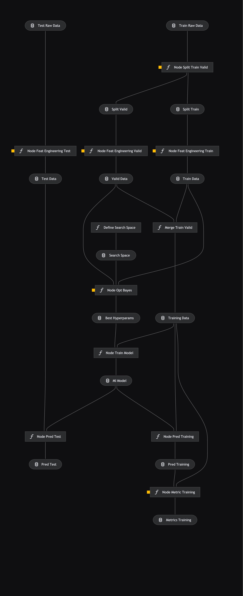

# House prices

## Introduction

The goal of this project is to predict the sale price of houses, from Kaggle [House prices prediction](https://www.kaggle.com/competitions/house-prices-advanced-regression-techniques/overview).

Firstly, the goal of this project is to use packages like MLflow to log experiments and Kedro to follow the overall process and run pipelines.


## Pipelines

### Data engineering

This pipeline is to prepare the datasets for the data science part. It is to split the training set into train and validation.


### Data science

The data science pipeline is doing the modelisation.
The process is :
* Remove outliers on the training dataset
* Feature engineering: create new features
* Split the training set into train and validation
* Train a Gradient Boosting Model on the train set and evaluate on the validation set
* Use bayesian optimization to find the best hyperparameters
* Train the model on the entire training set

### Model evaluation

The model evaluation pipeline evaluates the model created in the data science pipeline


## MLflow

### Overview

The runs of the different models are logged into MLflow. Take a look at the [MLflow documentation](https://mlflow.org/docs/latest/index.html) to get started.

### MLflow Tracking

For MLflow Tracking, a data science problem is defined as an experiment. Each time you run a machine learning model, you do a run. You can log several things to MLflow:
* Arguments: info about the run, like a name, a source, tags.
* Parameters: Should be the hyperparameters of the model. Can be anything you want.
* Metrics: Metrics of the specific run to be able to compare them. Each metric has to be a number.
* Artifacts: Files to attach to a run. Could be images, csv, json, etc.

All the runs with the info will be stored in a mlruns folder. To see the dashboard, you can run the following command in the terminal in the parent folder:
```
mlflow ui
```


## Kedro

### Overview

This is your new Kedro project, which was generated using `kedro 0.18.14`.

Take a look at the [Kedro documentation](https://docs.kedro.org) to get started.


To view the entire process of the pipeline, you can run in your terminal:

```
kedro viz
```

Here is the actual Kedro vizualiation:



### Rules and guidelines

In order to get the best out of the template:

* Don't remove any lines from the `.gitignore` file we provide
* Make sure your results can be reproduced by following a data engineering convention
* Don't commit data to your repository
* Don't commit any credentials or your local configuration to your repository. Keep all your credentials and local configuration in `conf/local/`

### How to install dependencies

Declare any dependencies in `src/requirements.txt` for `pip` installation and `src/environment.yml` for `conda` installation.

To install them, run:

```
pip install -r src/requirements.txt
```

### How to run your Kedro pipeline

You can run your Kedro project with:

```
kedro run
```

### How to test your Kedro project

Have a look at the file `src/tests/test_run.py` for instructions on how to write your tests. You can run your tests as follows:

```
kedro test
```

To configure the coverage threshold, go to the `.coveragerc` file.

### Project dependencies

To generate or update the dependency requirements for your project:

```
kedro build-reqs
```

This will `pip-compile` the contents of `src/requirements.txt` into a new file `src/requirements.lock`. You can see the output of the resolution by opening `src/requirements.lock`.

After this, if you'd like to update your project requirements, please update `src/requirements.txt` and re-run `kedro build-reqs`.

[Further information about project dependencies](https://docs.kedro.org/en/stable/kedro_project_setup/dependencies.html#project-specific-dependencies)

### How to work with Kedro and notebooks

> Note: Using `kedro jupyter` or `kedro ipython` to run your notebook provides these variables in scope: `context`, `catalog`, and `startup_error`.
>
> Jupyter, JupyterLab, and IPython are already included in the project requirements by default, so once you have run `pip install -r src/requirements.txt` you will not need to take any extra steps before you use them.

#### Jupyter
To use Jupyter notebooks in your Kedro project, you need to install Jupyter:

```
pip install jupyter
```

After installing Jupyter, you can start a local notebook server:

```
kedro jupyter notebook
```

#### JupyterLab
To use JupyterLab, you need to install it:

```
pip install jupyterlab
```

You can also start JupyterLab:

```
kedro jupyter lab
```

#### IPython
And if you want to run an IPython session:

```
kedro ipython
```

#### How to convert notebook cells to nodes in a Kedro project
You can move notebook code over into a Kedro project structure using a mixture of [cell tagging](https://jupyter-notebook.readthedocs.io/en/stable/changelog.html#release-5-0-0) and Kedro CLI commands.

By adding the `node` tag to a cell and running the command below, the cell's source code will be copied over to a Python file within `src/<package_name>/nodes/`:

```
kedro jupyter convert <filepath_to_my_notebook>
```
> *Note:* The name of the Python file matches the name of the original notebook.

Alternatively, you may want to transform all your notebooks in one go. Run the following command to convert all notebook files found in the project root directory and under any of its sub-folders:

```
kedro jupyter convert --all
```

#### How to ignore notebook output cells in `git`
To automatically strip out all output cell contents before committing to `git`, you can run `kedro activate-nbstripout`. This will add a hook in `.git/config` which will run `nbstripout` before anything is committed to `git`.

> *Note:* Your output cells will be retained locally.

### Package your Kedro project

[Further information about building project documentation and packaging your project](https://docs.kedro.org/en/stable/tutorial/package_a_project.html)
